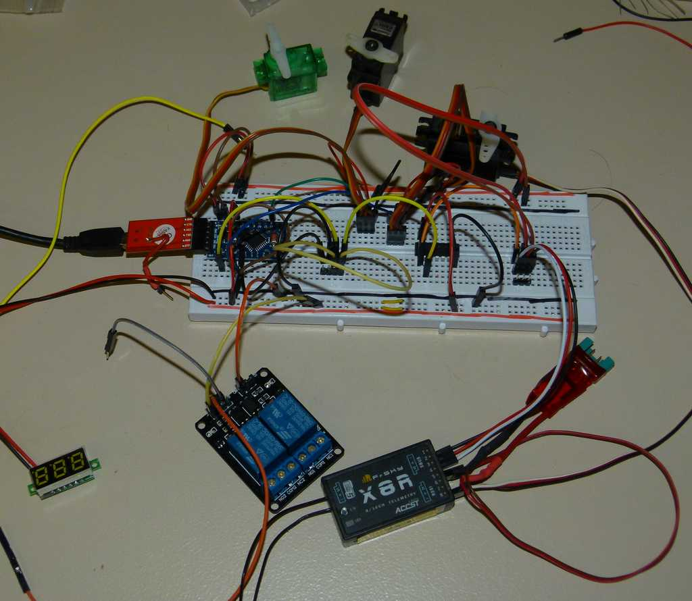
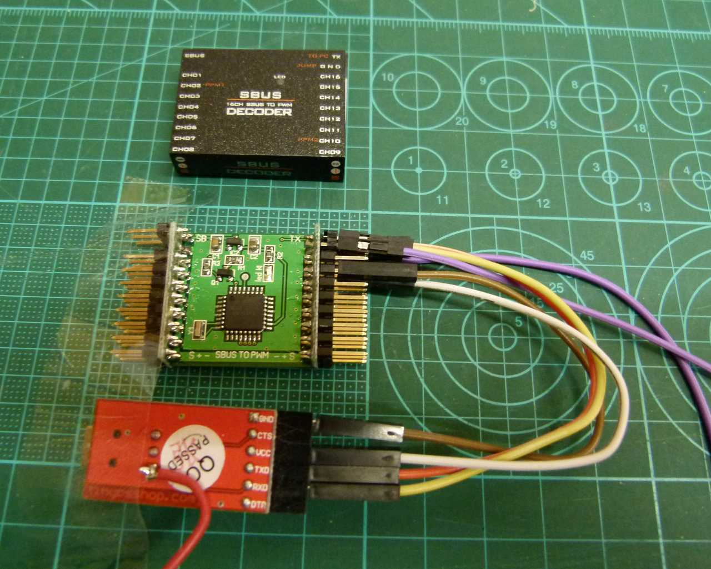
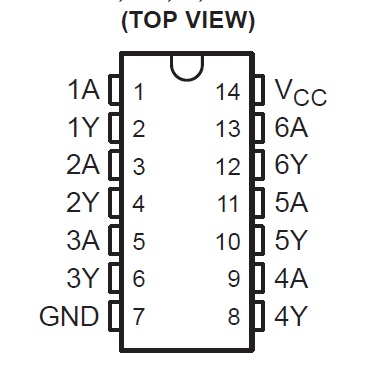
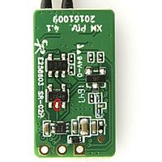
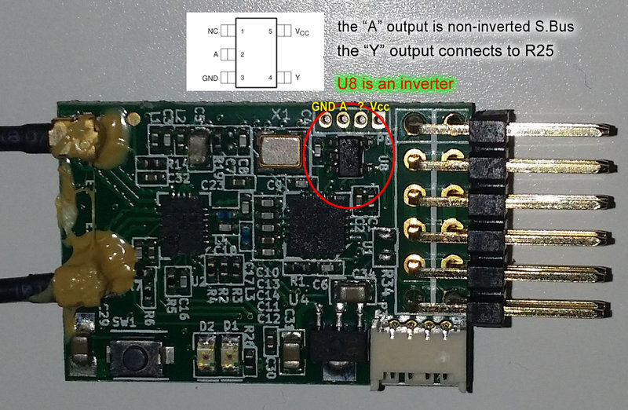
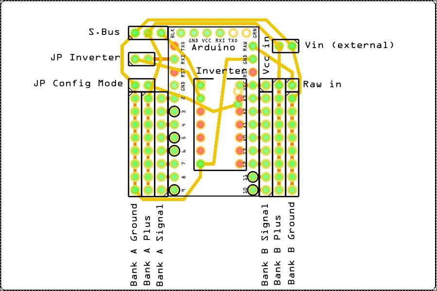

# SBus_Decoder V3.12

## Introduction
This project enables an Arduino to receive up to 16 channels send from any S.Bus receiver, decode them and forward the signals as 16 PWM signals (for connecting servos or ESC) and / or up to two independent PPM channels.
The way of handling the output can be configured via a Windows application.

V3 enhances the capabilites with an option for RC functional modelling to confiure all channels as "Switches" to drive up to 16 standard relay modules or DC SSR / Darlington arrays also.

* Connection of up to 16 servos or 16 relay modules in mixed manner
* Generation of up to 2 independent PPM signals
* Encoding up to 16 channels in each PPM
* Reassign s.Bus channels to any outputs of the decoder and / or to any location of the PPM signal
* Possibility of using one channel for several outputs
* Simultaneously output up to 8 any PWM channels and up to 16 PPM channels

All credits belong to the origin inventor of this project [Mactep8](https://github.com/mactep8).
As I am not able to read Russian language [Google Translator](https://translate.google.com/) helped a lot to understand most of this project (as a non-pro prorammer). Some of the information from the Mactep8 websites has been included in this Readme as well as information from other sources (credits will be given as good as possible).

## Links
Mactep8 origin idea was published here: http://rc-master.ucoz.ru/publ/19-1-0-87 and describes the hardware and the developing firmware for the Arduino. As an enhancement the code has been rewritten as V2 and the configuration application was been added here: http://rc-master.ucoz.ru/publ/19-1-0-105
The actual version V2 was published in the origin git https://github.com/mactep8/SBus_Decoder.
As he mentioned in the documentation he has not invented the wheel anew and uses the SBus driver from https://github.com/mikeshub/FUTABA_SBUS.

## Parts (BOM)
A small Arduino like Pro Mini, Mini, etc (then a USB2SERIAL converter is needed also). An Arduino Micro (e.g.) contains the USB converter onboard.
Together with some leads, an Inverter, a prototype board, a SBus output thing (e.g. S.Bus Receiver), some servos and a relay unit it ends up in:

Later on you can arrange like shown here:

Or even right out of the box with the help of our Chinese friends (purple lead is a jumper PC_EN -- GND):

Yes, they made a commercial product with an ATMega168PA of this idea using even the same configurator program. Available at least on [Banggood](https://www.banggood.com/DIY-SBUS-To-PWMPPM-Decoder-16CH-For-Futaba-Orange-Frsky-p-987248.html) for about $15. But it still needs USB2SERIAL for configuration. The onboard voltage regulator might be able to accept input voltage up to 6.5V (datasheet VR), This would be ok for most of the actual servos (not for all;) but be careful if using relay modules which normally accept 5V only. **Unfortunately I still have not had the time to get the V3 firmware working on this product. But you are still free to use the SBUS Decoder Configurator with V2 enabled.**

## Inverter
A short explanation of the Sbus protocol can be found here: https://github.com/bolderflight/SBUS/blob/master/README.md
The protocol uses inverted serial logic and therefore requires an inverter (again) to enable the Arduino working with the data. For most FrSky receivers (e.g.) you can find information / pictures on the Internet providing the position of the uninverted Sbus signal. In this case the inverter needs not be used.

### Hardware inverter
Many guys do this job with a transistor and some resistors like shown here (taken from RCG):

I personally never tested this. So, please do not ask if not working. Mactep8 used a Schmitt-Trigger Inverter 74HC14. The unit has 6 inverters but only one will be used.

### Receiver mods
Second option would be to use the non-inverted pin of a receiver direcly. On a FrSky X8R this task is a bit more difficult due to an extra PCB which needs to be removed for access: https://www.rcgroups.com/forums/showthread.php?2689044-Hacking-FrSky-x8r-for-use-with-sbus-to-naze32
Most of the smaller recievers are easy to modify (if you like) [Source RCG / Autoquad.org]:

Assuming that similar information is available for Spektrum or Futaba Receivers. If not, you can still use the hardware inverter option 1.

## Scheme

Top view

Please compare with the pictures above.

## Firmware
As usual the code can be flashed using the Arduino IDE. Of course, the folder FUTABA_SBUS has to be added as library via Sketch -> Include library -> Add .ZIP library. After flashing the Decoder must be initialized:

  * Set JP "Config Mode"
  * Run the SBUS Decoder Configurator
  * Select correct COM port
  * Load defaults
  * Check if version corresponds to the firmware
  * Click the Write button

## SBUS Decoder Configurator
The "Switched" V3 version includes the swtich functionality as well as a short instruction (from my Chinese friends program) for connecting the Decoder to a USB2SERIAL. Additionally a button "Load Defaults" and a Version button has been added. The program was written with Microsoft Visual C#. Bank A and B work absolutely independently of each other and there is no mutual influence of any settings between them.

For accessing the S.Bus Decoder connect the USB2SERIAL interface as you upload firmware. Set the JP "Config Mode" (Pin A4 to ground (GND)) and reset / reboot the Arduino.

When in Config Mode the internal LED (Pin D13) should not blink.

* COM: Select the correct COM port of your USB2SERIAL device.

* Read: Reads the saved configuration from The S.Bus Decoder. The configuration is stored in the EEPROM section of the Arduino. As long as the EEPROM is not initialized, clicking the Read button will cause the application to hang. After the first initialization, you can read / write the configuration as you like.

* Write: Writes all data to the S.Bus Decoder without further notice.

* Version: Select the configuration data version.
 * V2: Origin version of the Decoder without switches.
 * V3: New version with the possibility to use the outputs as switches.

 Reading / writing a V3 Config from a V2 firmware will cause an error or the app to hang and vice versa. You can read a V2 - update firmware to V3 - and then write as V3 or vice versa.

* Load Defaults: Once pressed the most common option will be loaded and can be written directly to the S.Bus Decoder.

* Checkbox PPM: If unchecked, the bank generates control signals for up to eight servo drives (PWM mode). If checked, the output of each bank (Ch1 for A and Ch9 for B) will be as PPM signal. The remaining bank outputs will not output any signal at this time.

* Frame: Set the frame length for PPM or the PWM frequency for the servo drives. The value is specified in milliseconds. For servo drives, 20ms are recommended, which corresponds to a frequency of 50Hz.

* Channels: Specifies how many channels will be displayed in this bank. For the PPM output mode, the maximum number of channels is calculated from the frame length automatically. But you can specify a smaller number.

* Ch1 - Ch16: The Ch number indicates the position of the signal in the bank. The drop-down list allows to select the channel number from the S.Bus. You can switch any channel transmitted from the console to any of the decoder's outputs. In the drop-down list of each output, you can select the value "FS". Selecting this value means that the failsafe is set for output. The signal will be output as a PWM with a pulse length of 1000 μs or 2000 μs.

* Checkbox Switches: If unchecked, the decoder will work described above. If checked, the Channels of Bank A and B can be assigned as low / high output without any PWM signal on the line. This output can be used to control the common Arduino relay modules. It does not matter if "Switches" is active (checked) as long as the channels will be left blank.

Attention: Not all receivers will send a communication loss signal to the S.Bus. Check that the output signals for your receiver are correct.

If getting the sync error (stk500_getsync()) while uploading firmware disconnect the S.Bus line through removing JP "Inverter" between Arduino and inverter or select the correct board;).

## Revision History
* V1 Published on http://rc-master.ucoz.ru/publ/19-1-0-87
* V2 Published on https://github.com/mactep8/SBus_Decoder
* V3 Initial version with switches
* V3.1 Corrections:
  * Ch9 and 10 blocked for use as a switch
  * Switching pins do have 0 volts now
* V3.11 Corrections:
  * ch8 available as switching pin
* V3.12 Correction:
  * ch9 and ch10 available also (failure due to hardware defect)  
