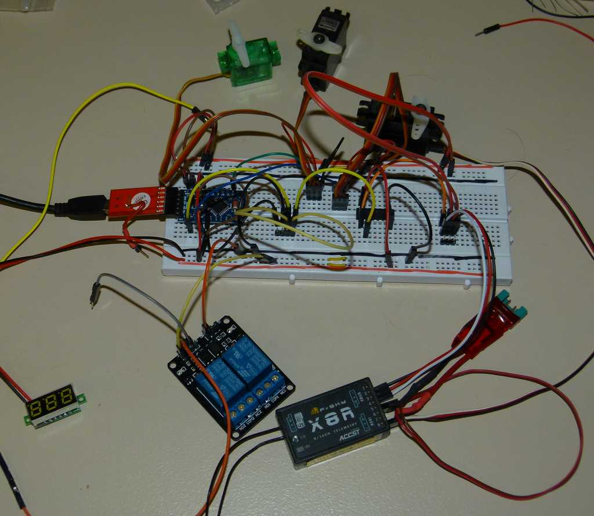
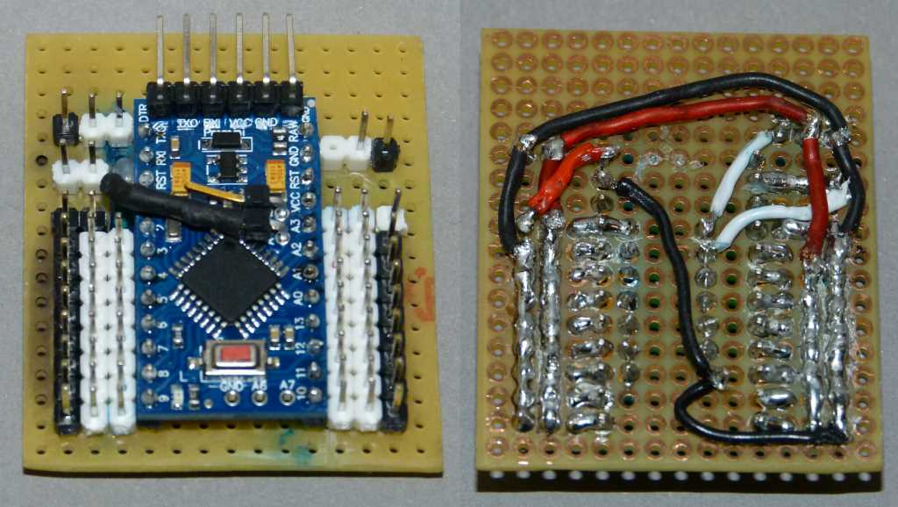
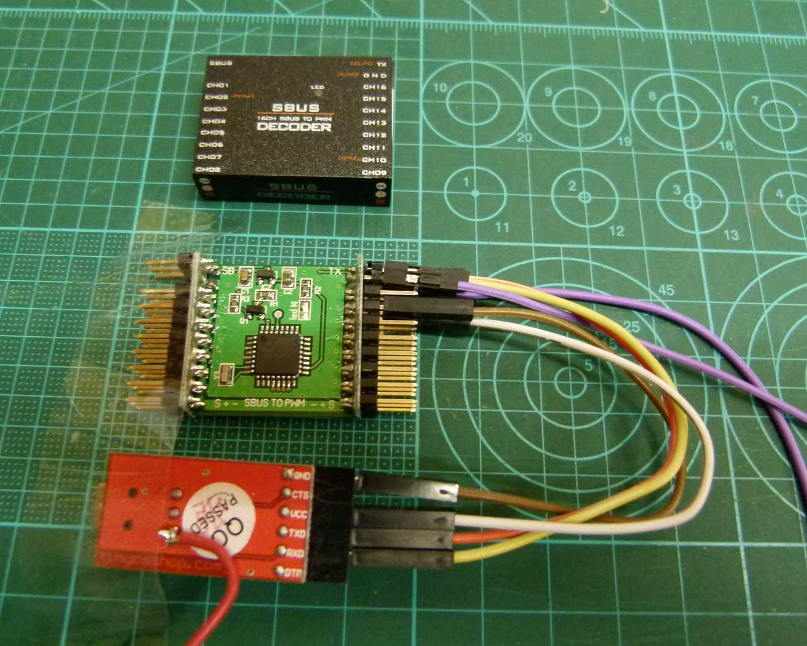
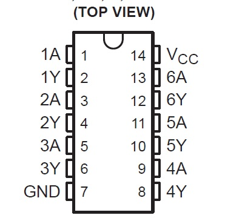
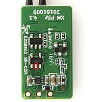
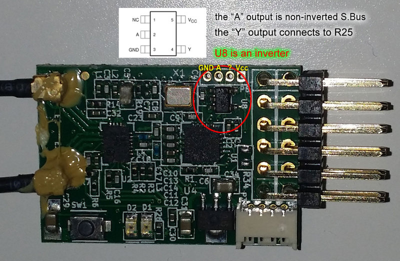
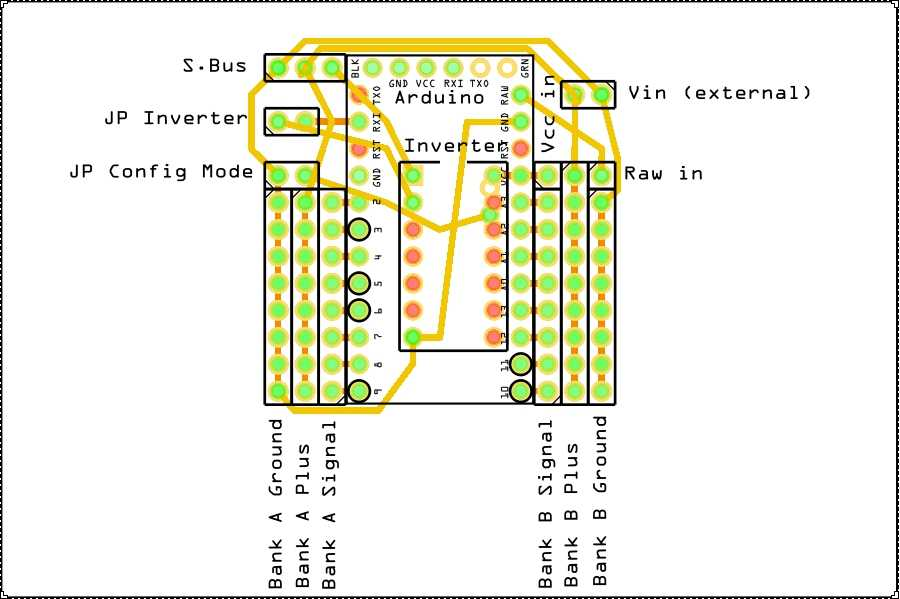
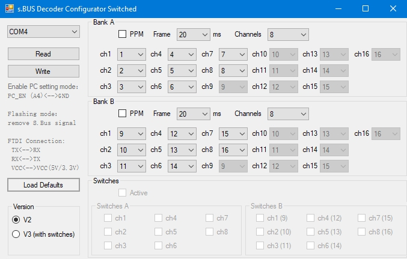

# SBus_Decoder V3.1

## Einführung
Dieses Projekt ermöglicht es einem Arduino, bis zu 16 Kanäle von jedem S.Bus-Empfänger zu empfangen, zu dekodieren und die Signale als 16 PWM-Signale (zum Anschluss von Servos oder Fahrtenreglern) und / oder bis zu zwei unabhängige PPM-Kanäle weiterzuleiten.
Die Art der Ausgabe kann über eine Windows-Programm konfiguriert werden.

V3 erweitert die Möglichkeiten mit einer Option für die RC-Funktionsmodellbau, um die Kanäle als "Schalter" für den Betrieb von bis zu 13 Standard-Relaismodulen (oder auch DC SSR / Darlington-Treiber) zu konfigurieren.

* Anschluss von bis zu 16 Servos oder 13 Relaismodulen in freier Folge
* Generierung von bis zu 2 unabhängigen PPM-Signalen
* Kodierung von bis zu 16 Kanälen in jedem PPM
* Neuzuweisung von S.Bus-Kanälen an alle Ausgänge des Decoders und / oder an jede Stelle des PPM-Signals
* Möglichkeit, einen Kanal für mehrere Ausgänge zu verwenden
* Gleichzeitige Ausgabe von bis zu 8 beliebigen PWM-Kanälen und bis zu 16 PPM-Kanälen

Alle Danksagungen gehören dem ursprünglichen Erfinder dieses Projekts [Mactep8] (https://github.com/mactep8).
Da ich die russische Sprache nicht lesen kann, hat [Google Übersetzer] (https://translate.google.com/) viel dazu beigetragen, das meiste dieses Projekts zu verstehen (als Nicht-Pro-Programmierer). Einige der Informationen von den Mactep8-Websites wurden in diese Readme-Datei zusammen mit Informationen aus anderen Quellen aufgenommen (Quellen werden so gut wie möglich angegeben).

## Verweise (Links)
Mactep8 ursprüngliche Idee wurde hier veröffentlicht: http://rc-master.ucoz.ru/publ/19-1-0-87 und beschreibt die Hardware und die Entwicklung der Firmware für den Arduino. Als Erweiterung wurde der Code als V2 neu geschrieben und die Konfigurationsanwendung wurde hier hinzugefügt: http://rc-master.ucoz.ru/publ/19-1-0-105
Die eigentliche Version V2 wurde im Herkunftsgit https://github.com/mactep8/SBus_Decoder veröffentlicht.
Wie er in der Dokumentation erwähnt hat, hat er das Rad nicht neu erfunden und verwendet den SBus Treiber von https://github.com/mikeshub/FUTABA_SBUS.

## Bauteile (Stückliste)
Einen kleinen Arduino wie Pro Mini, Mini usw. (dann wird auch ein USB2SERIAL Konverter benötigt). Ein Arduino Micro (z.B.) enthält den USB-Konverter bereits.
Zusammen mit einigen Leitungen, einem Inverter, einer Prototyp-Platine, einem SBus-Ausgangsgerät (z. B. S.Bus-Empfänger), einigen Servos und einer Relaiseinheit, endet es in:

Später kann man es wie hier gezeigt aufbauen:

Oder sogar direkt aus der Kiste mit Hilfe unserer chinesischen Freunde (lila Leitung ist ein Jumper PC_EN - GND):

Ja, sie haben ein kommerzielles Produkt mit einem ATMega168PA aus dieser Idee gemacht, sogar mit dem gleichen Konfiguratorprogramm. Verfügbar für ca. €12 bei Banggood (https://www.banggood.com/DIY-SBUS-To-PWMPPM-Decoder-16CH-For-Futaba-Orange-Frsky-p-987248.html). Aber das Teil benötigt immer noch den USB2SERIAL für die Konfiguration. Der Spannungsregler könnte Eingangsspannungen von bis zu 6,5 V vertragen (Datenblatt SR). Dies wäre für die meisten Servos ok (nicht für alle), aber bitte vorsichtig bleiben, wenn Relaismodule verwendet werden, die normalerweise nur 5 V akzeptieren. **Leider hatte ich noch nicht die Zeit, um die V3 Firmware auf diesem Decoder zum Laufen zu bringen. Es kann jedoch weiterhin der SBUS Decoder Configurator mit V2 verwendet werden.**

## Inverter
Eine kurze Erklärung des Sbus-Protokolls finden Sie hier: https://github.com/bolderflight/SBUS/blob/master/README.md
Das Protokoll verwendet eine invertierte serielle Logik und benötigt daher (erneut) einen Inverter, damit der Arduino mit den Daten arbeiten kann. Für die meisten FrSky-Empfänger z.B. gibt es aber Informationen / Bilder im Internet aus denen die Position des uninvertierten Sbus ersichtlich ist. In diesem Fall kann auf den Inverter verzichtet werden.

### Hardware Inverter
Viele Leute lassen diese Arbeit von einem Transistor und einigen Widerständen wie hier gezeigt erledigen (aus RCG):

Ich persönlich habe das nie getestet. Also, bitte nicht nachfragen, wenn es nicht funktioniert. Mactep8 verwendete einen Schmitt-Trigger Inverter 74HC14. Die Einheit verfügt über 6 Inverter, von denen jedoch nur einer verwendet wird.

### Empfänger Umbauten
Die zweite Option wäre, den nicht invertierten Pin eines Empfängers direkt zu verwenden. Auf einem FrSky X8R ist diese Aufgabe etwas schwieriger aufgrund einer zusätzlichen Platine, die für den Zugriff entfernt werden muss: https://www.rcgroups.com/forums/showthread.php?2689044-Hacking-FrSky-x8r-for-use-with-sbus-to-naze32
Die meisten der kleineren Empfänger sind leicht zu modifizieren (wenn man mag) [Quelle RCG / Autoquad.org]:

Es ist davon auszugehen, dass ähnliche Informationen für Spektrum- oder Futaba-Empfänger verfügbar sind. Wenn nicht, können Sie weiterhin die Hardware-Inverter Option 1 verwenden.

## Schaltplan

Draufsicht

Bitte mit den obigen Bildern vergleichen.

## Firmware
Wie üblich kann das Programm mit der Arduino IDE geflasht werden. Selbstverständlich muss der Ordner FUTABA_SBUS als Bibliothek eingebunden werden über Sketch -> Bibliothek einbinden -> .ZIP Bibliothek hinzufügen. Nach dem Übertragen der Firmware muss der Decoder initialisiert werden:

  * Setzen von JP "Config Mode"
  * Starten von SBUS Decoder Konfigurator
  * Auswählen des richtigen COM-Ports
  * Standardeinstellungen laden
  * Prüfen, ob die Version mit der Firmware übereinstimmt
  * Schaltfläche "Write" clicken

## SBUS Decoderkonfigurator
Die "Schalter" Version V3 beinhaltet Schalter-Funktionalität sowie eine kurze Anleitung (aus dem Programm der chinesischen Freunde) um den Decoder mit einem USB2SERIAL zu verbinden. Zusätzlich wurde eine Schaltfläche "Load Defaults" und eine Version-Schaltfläche hinzugefügt. Das Programm wurde mit Microsoft Visual C# geschrieben. Bank A und B arbeiten absolut unabhängig voneinander und es gibt keinen gegenseitigen Einfluss von irgendwelchen Einstellungen zwischen ihnen.

Um auf den S.Bus Decoder zuzugreifen, schließen Sie die USB2SERIAL-Adapter genauso an, als wenn die Firmware geflasht wird. Setzen des JP "Config Mode" (Pin A4 auf Masse (GND)) und reset / starten Sie den Arduino neu.

Im Konfigurationsmodus sollte die interne LED (Pin D13) nicht blinken.

* COM: Auswahl des richtigen COM-Port vom USB2SERIAL-Adapter.

* Read: Liest die gespeicherte Konfiguration vom S.Bus Decoder. Die Konfiguration wird im EEPROM-Bereich des Arduino gespeichert. Solange das EEPROM nicht initialisiert ist, bleibt nach Klicken auf die Schaltfläche "Read" die Anwendung hängen. Nach der ersten Initialisierung kann die Konfiguration gelesen / geschrieben werden, wie man möchte.

* Write: Schreibt alle Daten ohne weitere Benachrichtigung in den S.Bus Decoder.

* Version: Wählt die Version der Konfigurationsdaten.
 * V2: Originale Version des Decoders ohne Schalter.
 * V3: Neue Version mit der Möglichkeit, die Ausgänge als Schalter zu verwenden.

 Lesen / Schreiben einer V3-Konfiguration von einer V2-Firmware verursacht einen Fehler oder die App hängt und umgekehrt. Sie können eine V2 - Firmware auf V3 updaten - und dann als V3 schreiben oder umgekehrt.

* Load Defaults: Einmal gedrückt, werden die Standardeinstellungen geladen und können direkt in den S.Bus Decoder geschrieben werden.

* Kontrollkästchen PPM: Wenn diese Option deaktiviert ist, generiert die Bank Steuersignale für bis zu acht Servos (PWM Modus). Wenn aktiviert, wird der Ausgang jeder Bank (Ch1 für A und Ch9 für B) als PPM-Signal ausgegeben. Die übrigen Bankausgänge geben dann kein Signal aus.

* Frame: Stellen Sie die Framelänge für PPM oder die PWM-Frequenz für die Servoantriebe ein. Der Wert wird in Millisekunden angegeben. Für Servoantriebe werden 20ms empfohlen, was einer Frequenz von 50Hz entspricht.

* Kanäle: Gibt an, wie viele Kanäle in dieser Bank angezeigt werden. Für den PPM-Ausgabemodus wird die maximale Anzahl von Kanälen automatisch aus der Rahmenlänge berechnet. Es können jedoch auch weniger Kanäle angeben werden.

* Ch1 - Ch16: Die Ch-Nummer zeigt die Position des Signals in der Bank an. Die Dropdown-Liste ermöglicht die Auswahl der Kanalnummer aus den S.Bus-Daten. Es kann jeder Kanal, der gesendet wird, an einen der Ausgänge des Decoders umschaltet werden. In der Dropdown-Liste eines jeden Ausgangs kann auch der Wert "FS" auswählt werden. Wenn er auswählt wird, dann ist "Failsafe" für die Ausgabe festgelegt. Das Signal wird als PWM mit einer Pulslänge von 1000 μs oder 2000 μs ausgegeben.

* Kontrollkästchen Schalter: Wenn nicht markiert, funktioniert der Decoder wie oben beschrieben. Wenn diese Option aktiviert ist, können die Kanäle von Bank A und B als Low / High-Ausgang ohne PWM-Signal auf der Leitung zugewiesen werden. Diese Ausgänge können dann zur Steuerung der Relaismodule verwendet werden. Es spielt keine Rolle, ob das Kontrollkästchen aktiv ist (aktiviert), solange die Kanäle leer bleiben. Ch 8, 9 und 10 sind blockiert und können nur für den PWM (Servo) Betrieb verwendet werden.

Achtung: Nicht alle Empfänger senden ein Failsafe-Signal an den S.Bus. Bitte überprüfen, ob die Ausgangssignale des verwendeten Empfängers korrekt sind.

Wenn der Synchronisierungsfehler (stk500_getsync ()) beim Hochladen der Firmware auftritt, die S.Bus-Leitung trennen durch Entfernen von JP "Inverter" zwischen Arduino und Inverter oder in der IDE den korrekten Arduino auswählen;).

## Historie
* V1 Veröffentlicht auf http://rc-master.ucoz.ru/publ/19-1-0-87
* V2 Veröffentlicht auf https://github.com/mactep8/SBus_Decoder
* V3 Ursprungsversion mit Schaltern
* V3.1 Korrekturen:
  * Ch9 und Ch10 nicht zur Benutzung als Schalter
  * Schalt-Pins haben nun 0 Volt
